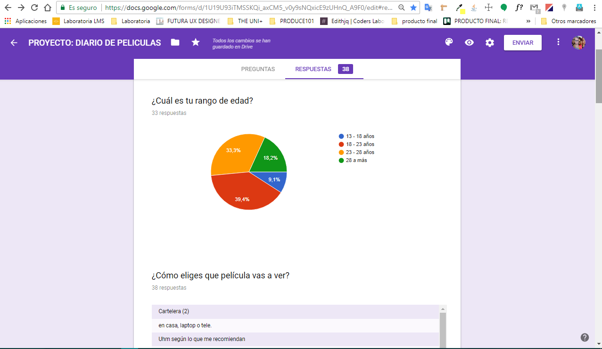
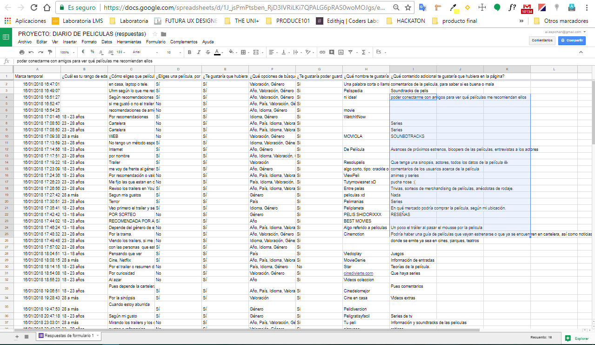
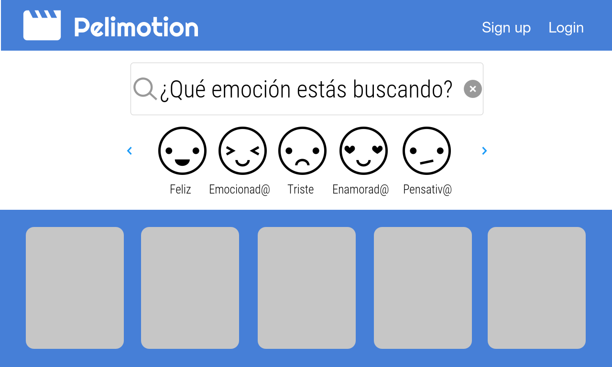
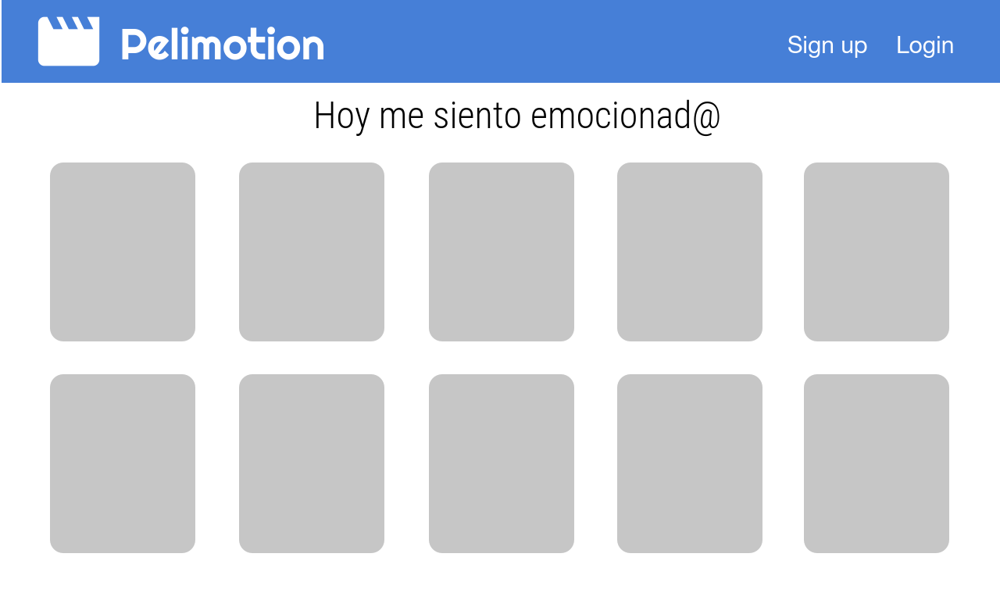
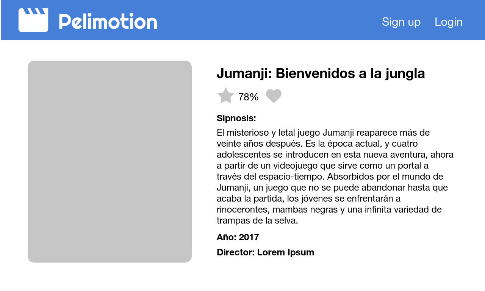
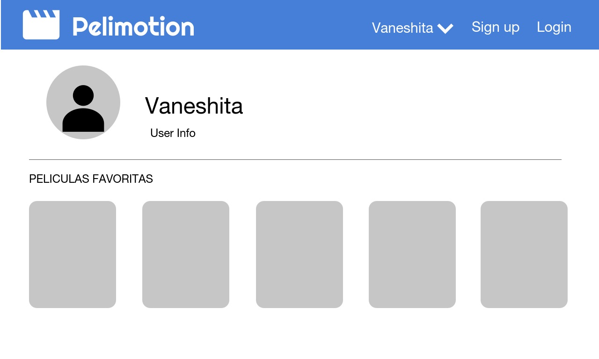
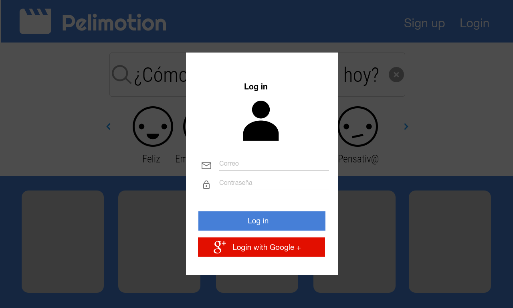

# HACKATON LABORATORIA: __PeliMotion__

## Equipo conformado por

+ RUTH MATOS
+ AURORA VASQUEZ
+ VANESSA MENDOZA
+ AYLIN ESPICHAN

## Herramientas Utilizadas

+ HTML5
+ CSS3
+ BOOTSTRAP
+ OMDB API
+ FIREBASE

___

## INTRODUCCIÓN

En la actualidad, hay muchas páginas que nos permiten tener acceso a nuestras películas favorita en cualquier momento y lugar, pero...

¿y si no tienes idea de que película quieres ver? o ¿buscas esa película que te haga llorar a mares o te haga sentir miedo hasta de tu propia sombra?
Pues para eso tienes a __PELIMOTION.__

__PELIMOTION__ se enfoca en brindar a nuestros usuario recomendaciones, de acuerdo a la emoción que deseen experimentar.

___

### PLANIFICACIÓN

#### Primer Día

+ Realizamos una lluvia de ideas para encontrar la problemática que buscamos resolver.
+ Luego de esto fuimos escogiendo las ideas que más nos gustaban, colocándolas en nuestra pizarra.

+ Una vez establecidas nuestras tres preguntas importantes *¿Cúal es nuestro objetivo?*, *¿Qué necesidad queremos cubrir?, ¿A quién  esta dirigida?* cada una hizo un sketch a lapiz de como debería ser la vista principal, luego de ver las ideas de todas elegimos esta.

> hecho por Vanessa Mendoza

+ Empezamos nuestro research con una pequeña [encuesta online][encuesta] hecha por Aylin Espichan, obteniendo una data en base a 38 colaboradores.

[encuesta]: https://goo.gl/forms/zQ277pSoObRqNnjy1

+ Con nuestras ideas en orden y una imagen inicial de nuestra página, lo siguiente fue el [prototipo][prototipo] inicial para empezar el proceso de desarrollo, que fue hecho por Ruth Matos

[prototipo]: https://share.proto.io/J0Q4QI/

~. __Vista Inicial:__

~. __Vista Resultados__

~. __Vista Selección 1:__

~. __Vista Selección - Mi cuenta:__

~. __Modal SignUp:__

~. __Modal login:__

+ Por último creamos un [tablero][trello] en trello para mantener un registro de las tareas que iremos realizando cada una. Además tambien se creo el repositorio oficial, hecho por Aurora Vasquez.

[trello]: https://trello.com/b/zDPbf5a3/plan-de-acciones-hackaton

#### Segundo Día

+ Tuvimos la presentación de nuestro primer avance, donde recibimos feedback. El cual aplicamos para la planificación del día.

+ Aurora y Vanessa: investigaran el API de OMDB, como obtener sus datos y poder mostrarlo en nuestro producto.

+ Ruth y Aylin: realizaron una busqueda de estilos, entre colores e imagenes, tambien realizaron la elección del logo de nuestro producto.

+ Al final del día realizamos la repartición del trabajo, tanto el maquetado como la funcionalidad.

#### Tercer Día

+ Durante el tercer Día iniciamos realizando los maquetados, de acuerdo a nuestro prototipo, en el avance estaban encargadas Ruth Matos y Aylin Espichan.

+ En paralelo se realizo el desarrollo de la funcionalidad por parte de Vanessa Mendoza y Aurora Vasquez.

+ También empezamos a fusionar trabajos, en busca de posibles conflictos que se han ido corrigiendo hasta el momento.

### EXPECTATIVAS

Esperamos tener un producto funcional y brindar una buena experiencia a nuestros futuros usuarios.
