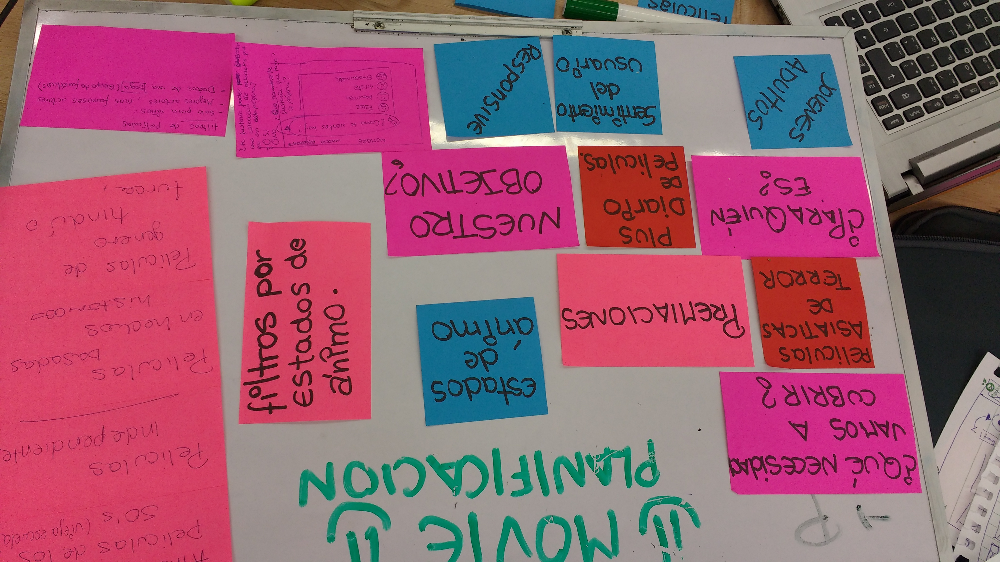
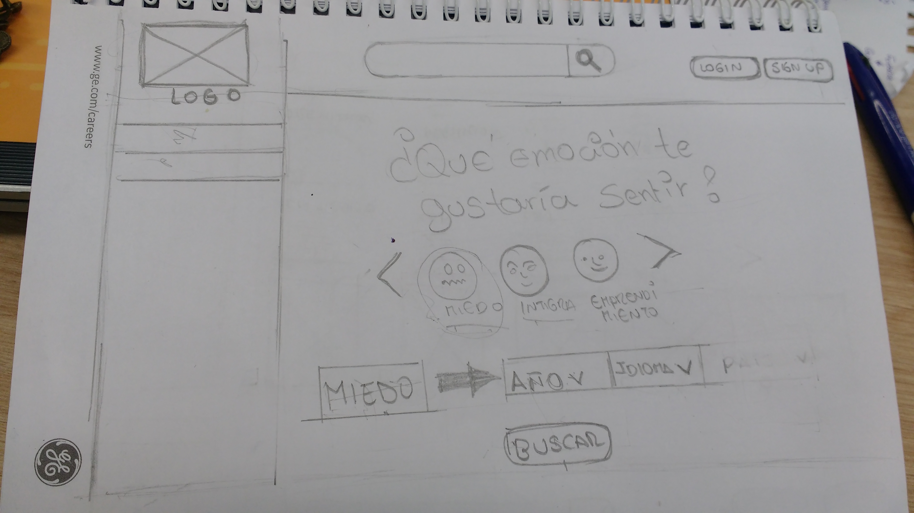

# HACKATON LABORATORIA: 

## Equipo conformado por:
+ RUTH MATOS
+ AURORA VASQUEZ
+ VANESSA MENDOZA
+ AYLIN ESPICHAN

### Primer Día:
+ Realizamos una lluvia de ideas para encontrar la problematica que buscamos resolver.
+ Luego de esto fuimos escogiendo las ideas que más nos gustaban, fuimos colocandolo en nuestra pizarra.

+ Una vez establecido las tres preguntas importantes *¿nuestro objetivo?*, *¿que necesidad queremos cubrir?, ¿a quien esta dirigida?* cada una hizo un sketch a lapiz de como debería ser la vista principal, luego de ver las ideas de todas elegimos esta.

> hecho por Vanessa Mendoza

+ Empezamos nuestros research con una pequeña [encuesta online][encuesta] hecho por Aylin Espichan

[encuesta]: https://goo.gl/forms/zQ277pSoObRqNnjy1

+ con nuestras ideas en orden y una imagen inicial de nuestra página, lo siguiente fue el [prototipo][prototipo] inicial para empezar el proceso de desarrollo, que fue hecho por Ruth Matos

[prototipo]: https://share.proto.io/J0Q4QI/

+ acabandose el día creamos un [tablero][trello] en trello para mantener un registro de que tarea iremos realizando cada una y el repositorio inicial, hecho por Aurora Vasquez

[trello]: https://trello.com/b/zDPbf5a3/plan-de-acciones-hackaton
